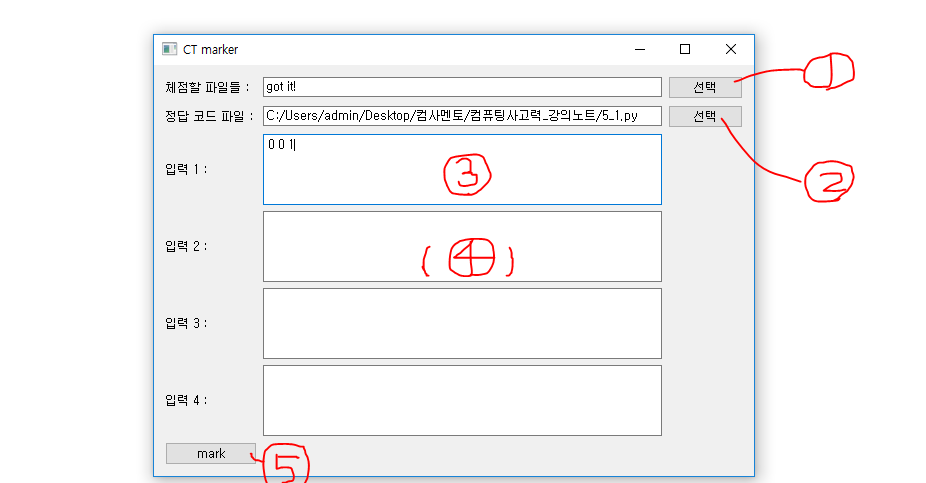
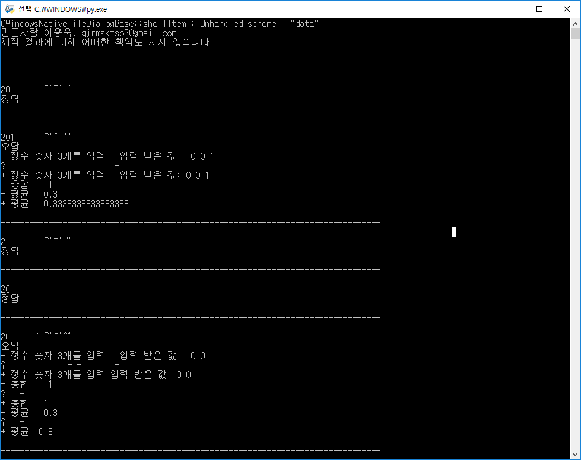

# 컴퓨팅사고력 멘토를 위한 채점 프로그램

## 소개

컴퓨팅사고력 조교를 위한 채점 프로그램 CT Marker입니다.

사용자가 입력한 테스트 케이스에 대해서 학생들의 코드를 한번에 채점하고, 정답과 불일치하는 경우, difflib.differ() 를 이용하여 차이점을 표시하여 출력해줍니다.

원래 수강생 목록 엑셀 파일에서 학생들의 이름과 학번을 읽어와서 

## 사용 방법

### 필요한 라이브러리

##### - python3

##### - pyqt5

##### - subprocess

##### - difflib

### 파일 선택

**qt.py 를 실행해서 프로그램을 실행합니다.**

1번 버튼을 눌러 채점할 파일을 모두 선택합니다.

2번 버튼을 눌러 채점할 과제 또는 실습의 정답 코드 파일을 선택합니다.

3번 영역에는 테스트할 입력을 입력할 수 있습니다.

총 4개가 입력가능하며, 불필요할 경우 빈 칸으로 남겨두면 됩니다.

5번 mark버튼을 누르면 채점이 시작됩니다.

### 채점 결과

채점 결과가 줄로 구분되어 출력됩니다.

첫 줄에는 학생의 학번과 이름이 출력됩니다.

학생들의 코드의 출력과 정답 코드의 출력이 정확히 일치한 경우, '정답'을 출력합니다.

일치하지 않은 경우  difflib.differ()를 이용하여 두 문자열을 비교한 결과를 출력합니다.

'+' 로 시작하여 출력되는 문자열이 학생 답안의 출력이고,

'-' 로 시작하여 출력되는 문자열이 정답의 출력입니다.

'?'로 시작하는 문장은 두 문자열의 차이점을 알려줍니다.

공백으로 시작하는 문장은 학생 답안의 출력과 정답 코드의 출력이 일치한 문장입니다.

위의 사진에서는 첫 학생은 정답과 출력이 일치했으며,

두번째 학생은 0.3을 출력해야 하는데, 0.33333... 을 출력했음을 알 수 있습니다.

## 패치 노트

첫 버젼은 수강생의 정보가 담긴 엑셀 파일을 이용하였습니다.

하지만 불편함으로 인해 사용자가 직접 채점할 파일을 선택하는 것으로 방식을 바꾸었습니다.

이 방법은 더 편리하지만, 미제출과 파일명 오기는 감지할 수 없다는 단점이 있습니다.

미제출과 파일명 오기를 감지할 수 있는 추가 기능도 시간이 된다면 개발하겠습니다.

엑셀 파일을 이용하고 싶으시면, a4e8394bf941a91e44291143a4cd68dc2ffeaee7 커밋 버젼을 사용하면 됩니다.

## 주의

채점 결과에 대해 어떠한 책임도 지지 않습니다.

이 채점 프로그램은 보조용입니다.
직접 학생들의 코드를 한번 더 확인해주시기 바랍니다.
저 또한 보조용으로 사용하고 있으며, 모든 학생들의 코드를 다시 확인하고 있습니다.

### 참고한 사이트

PyQt5 tutorials : https://wikidocs.net/21952

Python regex : http://pythonstudy.xyz/python/article/401-%EC%A0%95%EA%B7%9C-%ED%91%9C%ED%98%84%EC%8B%9D-Regex
